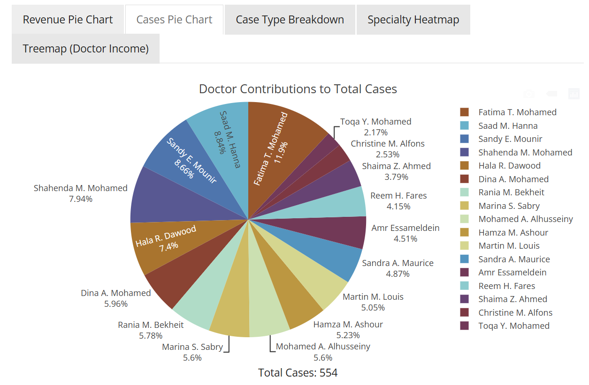
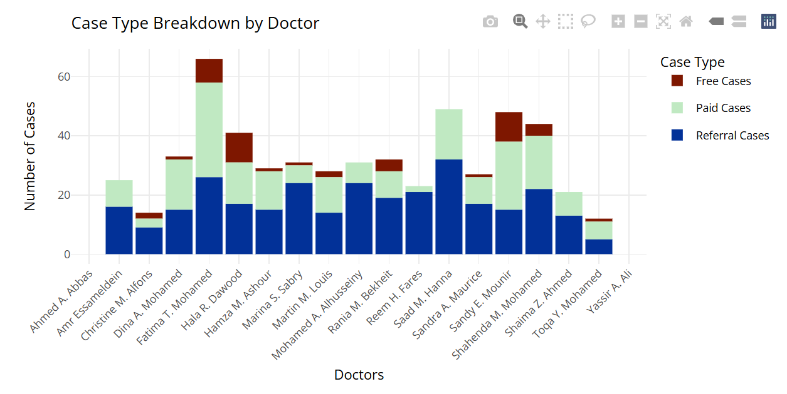
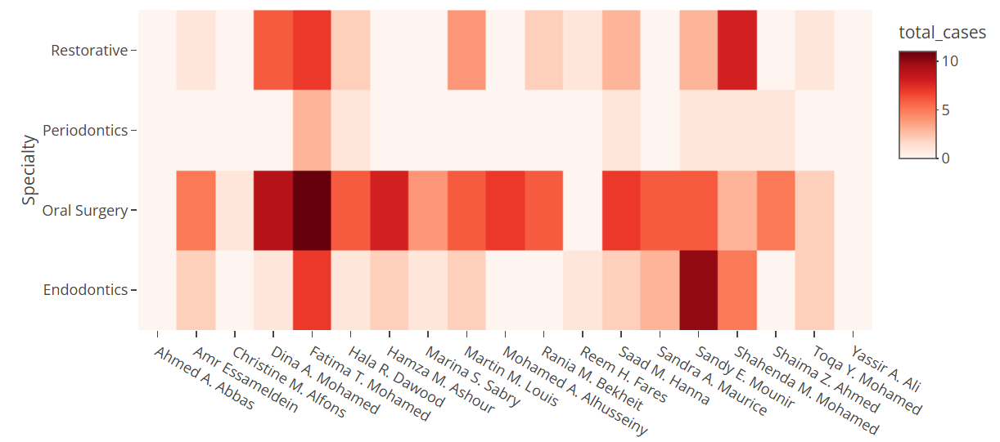
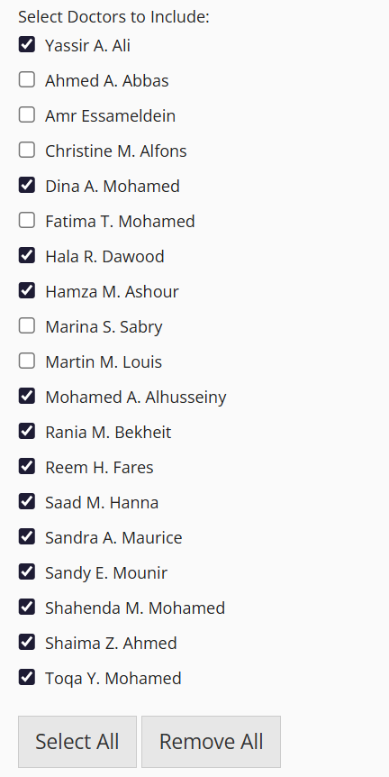

# Digital Health Insights: Interactive Dental Statistics  

**A visualization-driven approach to optimize dental practice management using R and Shiny.**  
---

## Overview  

Monthly reports in dental practices often come as bulky, unstructured Excel files:  
- Merged cells, typos, and inconsistent formatting  
- Difficult to process with computers  
- Limited utility for decision-making  

This project cleans and transforms these reports into **interactive, user-friendly dashboards** using **R** and **Shiny**.  
It enables managers to quickly analyze performance, revenue, and workforce distribution — turning raw data into actionable insights.  

---
## Interactive Dashboard

---

## Features  

- **Revenue Chart (Pie)** – visualize total revenue and dentist-specific contributions  
- **Case Chart** – track each doctor's contribution to the total number of cases 
- **Case Type Breakdown** – toggle case types per dentist for deeper analysis  
- **Speciality Heatmap** – identify dentist strengths and allocate resources effectively  
- **Income Treemap** – compare dentist payouts at a glance  
- **Interactive Controls** – “Select All” / “Remove All” buttons for smooth filtering  

---

## Tech Stack  

- **R** (data cleaning, transformation)  
- **Shiny** (interactive dashboards)  
- **tidyverse** (data wrangling and visualization)  

---

## Showcase

   
  <em>Figure 1. Chart of each doctor's contribution to the total cases.</em>

   
  <em>Figure 2. Case type breakdown for each doctor.</em>

   
  <em>Figure 3. Interactive heatmap of different specialities.</em>

   
  <em>Figure 4. Controls for selective viewing of each doctor.</em>

---

